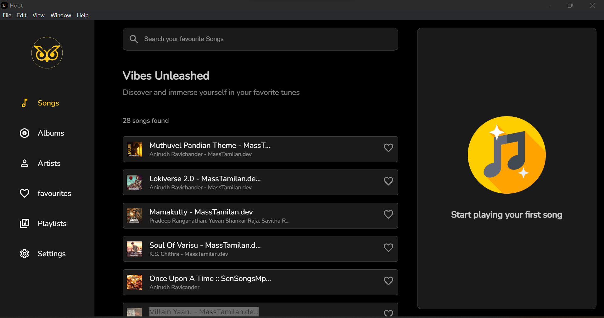
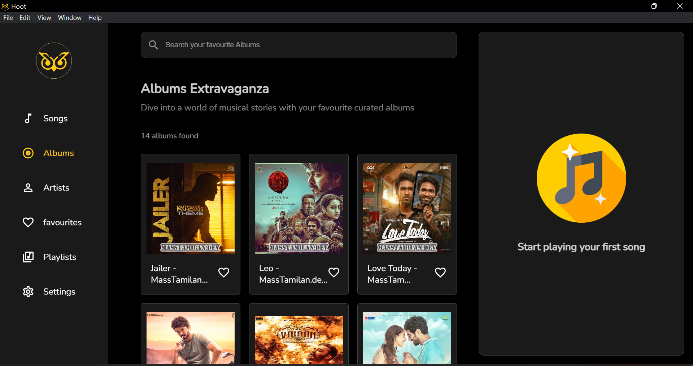

# Hoot - A Music Player Application

## Overview

Hoot is a sleek and intuitive music player application built with Electron.js, React, and SQLite for desktops. It provides a seamless and enjoyable music playback experience with features like playlist management, a user-friendly interface, and robust database storage.

## Table of Contents

- [Installation](#installation)
- [Usage](#usage)
- [Features](#features)
- [Technologies](#technologies)
- [Screenshots](#screenshots)
  
## Installation <a name="installation"></a>

To run Hoot Music Player locally, follow these steps:

```bash
# Clone the repository
https://github.com/Akshay-Jayan3/Hoot

# Navigate to the project folder
cd hoot

# Install dependencies
npm install

# Build the Application
npm run electron:package:win (for Windows users)
npm run electron:package:mac (for mac users)
npm run electron:package:linux (for ubuntu users)
An App folder will be created which will have a Hoot.setup.exe file which can be installed on your device.
```

## Features <a name="Features"></a>
1. Intuitive Interface: Clean and user-friendly interface for easy navigation.
2. Playlist Management: Create, edit, and organize playlists effortlessly.
3. Database Storage: Utilizes SQLite for efficient and reliable data storage.
4. Upload music: One can upload their music collection and enjoy playing their favorite music tracks.
5. Theme customization: Dark and light theme customization

## Technologies <a name="Technologies"></a>
Hoot Music Player is built with the following technologies:

1. Electron.js: Enables cross-platform desktop app development.
2. React : A JavaScript library for building user interfaces.
3. SQLite: A lightweight, serverless database engine.

## Screenshots  <a name="Screenshots"></a>




